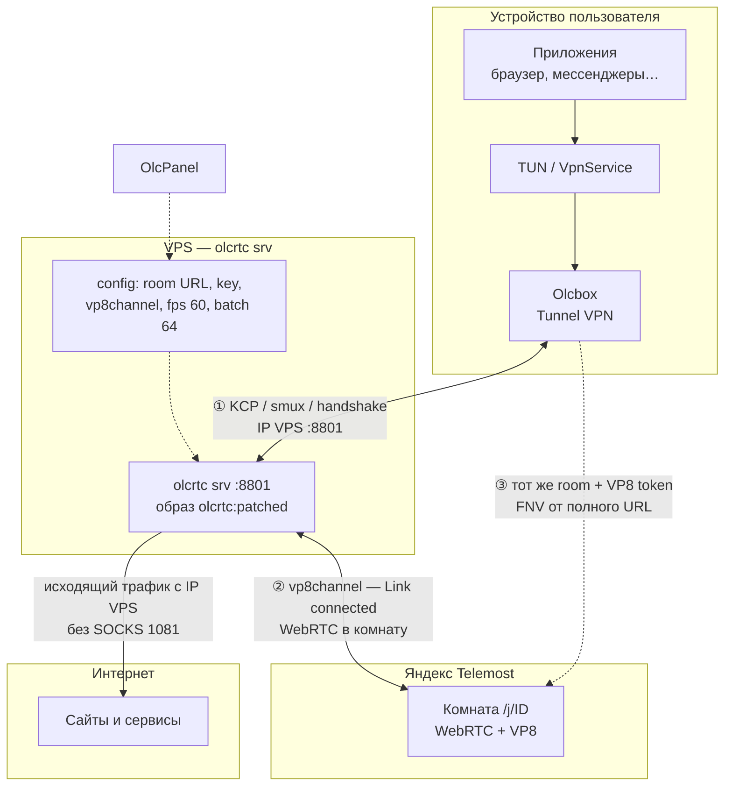
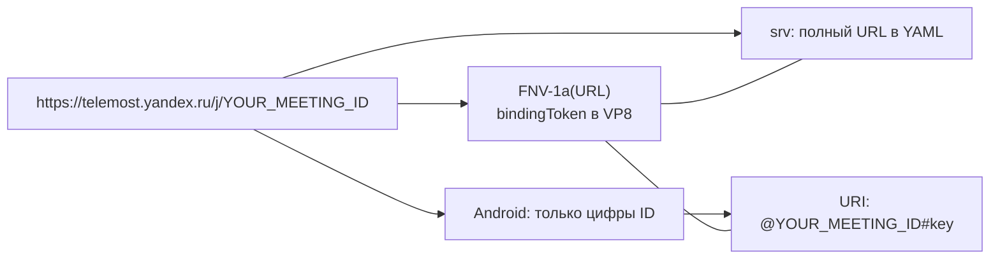
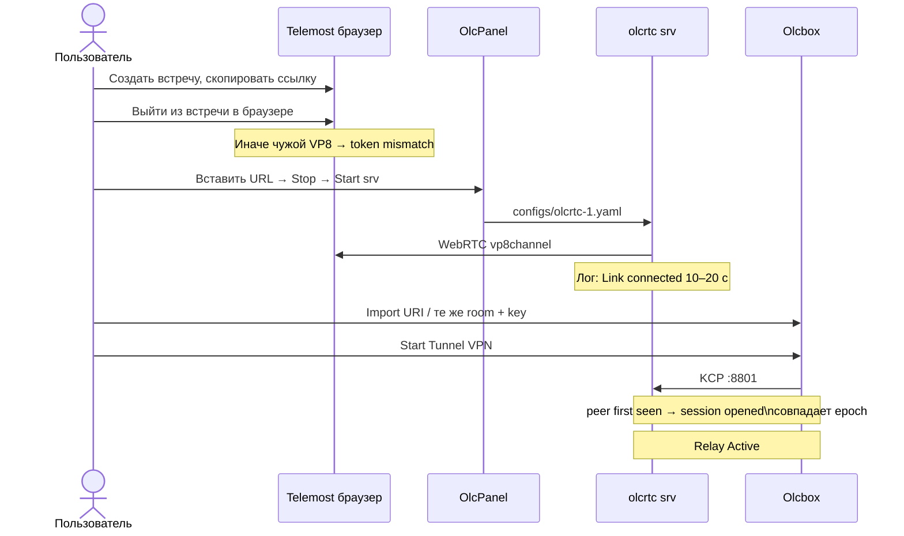
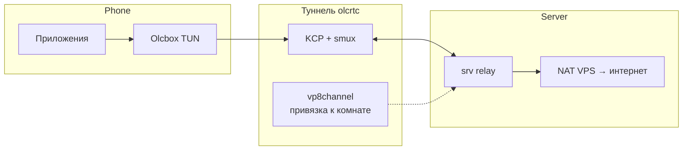
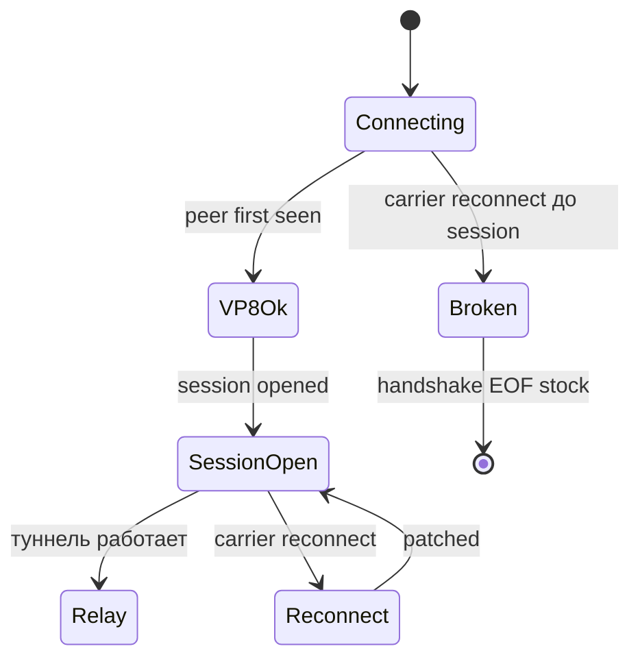

# Olc + Telemost: как связаны клиент, сервер и встреча

Документ описывает **логику соединения** Olcbox (клиент) и olcrtc **srv** (сервер) через **Яндекс Telemost** — ветка `universal-carrier`, транспорт **`vp8channel`**.

Практическая настройка Android: [`docs/olcbox_android_telemost.md`](olcbox_android_telemost.md).  
Развёртывание VPS и панели: [DEPLOYMENT.md](DEPLOYMENT.md).

---

## Роли

| Узел | Что это | Где |
|------|---------|-----|
| **Telemost** | Облако Яндекса, комната `https://telemost.yandex.ru/j/<ID>` | Интернет |
| **srv** | olcrtc в режиме сервера; «участник» комнаты по **vp8channel** | VPS (`olcrtc-1`, порт **8801**) |
| **Olcbox (cnc)** | olcrtc-клиент; режим **Tunnel VPN** | Телефон / ПК |
| **OlcPanel** | Задаёт room, key, VP8 fps/batch, URI для импорта | `https://<domain>:808` |

**Carrier = Telemost** — olcrtc не заменяет Телемост, а использует **встречу** как транспортный носитель (carrier).

---

## Общая схема



### Два стыка

1. **Прямой туннель** — Olcbox → srv по **KCP** на порт **8801** (VPS).
2. **Общая комната Telemost** — srv входит во встречу; клиент привязан к **той же** комнате и VP8-параметрам.

Совпадение проверяется **токеном VP8** = FNV-1a от **полной** строки URL комнаты. Разные room/key → `frame token mismatch`, `got` ≠ `want`.

---

## Комната и токен VP8



| Платформа | Поле Room |
|-----------|-----------|
| **srv** (OlcPanel) | полный URL `https://telemost.yandex.ru/j/…` |
| **Android Olcbox** | только цифры `YOUR_MEETING_ID` (не вставлять полный URL) |
| **Windows** | можно полный URL |

**Key** — общий hex из панели (в URI после `#`).

Формат URI:

```text
olcrtc://telemost?vp8channel<vp8-fps=60&vp8-batch=64>@YOUR_MEETING_ID#<key_hex>
         │          │                              │              │
      carrier     transport                      room ID         секрет
```

---

## Порядок подключения



**Правило:** сначала **srv** (`Link connected`), затем **Start** на клиенте. Не спамить Start на телефоне.

---

## Поток трафика после session opened



На **srv** отключён `socks.proxy 127.0.0.1:1081` — исходящие соединения с **IP VPS** (патч `olcpanel_srv_direct_dial`).

---

## Патч defer carrier reconnect

Telemost периодически переподключает WebRTC (`client reconnect reason=carrier`). Stock olcrtc рвёт **smux** до `session opened` → `handshake EOF`.

**`olcrtc:patched`** откладывает carrier-reconnect до открытой сессии.



---

## Типичные ошибки

| Симптом | Причина | Действие |
|---------|---------|----------|
| `frame token mismatch` | Браузер в той же комнате или другой room | Выйти из Telemost в браузере; проверить URL |
| `got` ≠ `want` | Другой room/key на клиенте | Copy URI с панели → Import |
| `handshake EOF` | carrier reconnect до session | patched olcrtc; Stop→Start srv, подождать 15 с |
| `handshake read hdr: timeout` | srv перезапущен / неверный key | Сначала srv, потом телефон |
| Сессия есть, трафика нет | режим **Proxy** вместо Tunnel VPN | Tunnel VPN + разрешение VPN |
| STUN timeout на LTE | сеть оператора | Wi‑Fi |

---

## Логи (что считать нормой)

**srv:**

```text
Link connected
vp8channel: peer first seen epoch=0x........ 
session opened
```

**Olcbox:**

```text
KCP started
vp8channel: peer first seen epoch=0x........
session opened
Relay Active
```

Эпохи **peer first seen** на клиенте и srv должны совпадать.

---

## Параметры (пример)

| Параметр | Значение |
|----------|----------|
| room | `https://telemost.yandex.ru/j/YOUR_MEETING_ID` |
| transport | `vp8channel` |
| vp8-fps / vp8-batch | **60** / **64** |
| образ srv | `olcrtc:patched` |
| want (FNV токен) | в логах srv — FNV от **вашего** полного URL комнаты |

---

## Ссылки

- [olcrtc URI format](https://github.com/openlibrecommunity/olcrtc/blob/refactor/universal-carrier/docs/uri.md)
- [Olcbox nightly-universal-carrier](https://github.com/alananisimov/olcbox/releases/tag/nightly-universal-carrier)
- [olcbox #56 — Telemost VP8](https://github.com/alananisimov/olcbox/issues/56)
- Android: [`docs/olcbox_android_telemost.md`](olcbox_android_telemost.md)
- Deploy: [`deploy/olcpanel/README.md`](../deploy/olcpanel/README.md)
